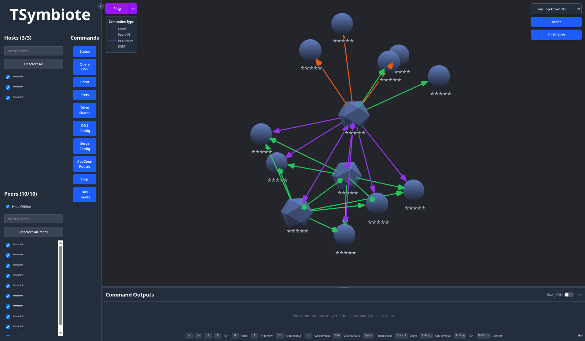

# TSymbiote
A debugging tool for Tailscale.

I originally created this as my personal Tailscale deployment had no easy way to map it due to network flow logs being a Premium+ feature. 

Every feature added to Tsymbiote (Kubernetes Operator excluded) will work for free users.  
With a little more work it can be fully compatible with `Headscale` as well if there is interest.  
TSymbiote can be used to map a current network and allow for debugging remote hosts.

TSymbiote attaches to an existing Tailscale deployment or client, essentially impersonating it.  
The WebUI when there are multiple adapters present will allow sending concurrent requests/commands to every selected host.

This means for instance, you can run a `Ping` from every host with a TSymbiote adapter to every peer it can communicate with at once.    
The connections between node/peer is color coded with the last ping response received from the target.

You can see the state of tailnet from the view of a host and surface debug information from multiple hosts at once.  

One use case could be a client is having trouble with their Tailscale client, be it connection, etc. 
You can give them an auth key and interact with tailscaled directly on their machine while supplying them a single command to run in their terminal.

This is very much a work in progress/hobby project, `use at your own risk`.  
 
I make `no guarantees of security or functionality`.





# Basic usage
Both the WebUI and Adapter can be run as CLIs.

Set the environment variables below using a key that has `devices:core:read` and `auth_keys` scopes:
```
TS_OAUTH_CLIENT_ID
TS_OAUTH_CLIENT_SECRET
```
```
tsymbiote webui --generate-auth
```

The `--generate-auth` is used to generate an auth key for itself so the service can utilize `tsnet`.  
If you do not include this flag, you do not need the `auth_keys` scope, but you will need to supply `TS_AUTHKEY` via env var. 
The webui will be served over `tsnet` by default on the port `3621`.

`--dev` can be added if you'd like to access the service over http/localhost instead.


The adapter can also be run locally.
(This has only been tested on Linux, but it should work on MacOS, Windows i am entirely unsure.)
Supply a `tsnet` auth key using the `TS_AUTHKEY` env var.  
NOTE: If you supply an ephemeral key, shutdown of the adapter will invalidate the credentials immediately.

```
tsymbiote adapter
```  

If your tailscaled socket is in a different location (windows) you may need to supply `--socket=$PATH_TO_TAILSCALED`.


## Adapter
The adapter attaches to a running Tailscale host and executes LocalAPI calls AS the host.

The adapter only listens over a tsnet bound interface and will only to reply to devices with a specific tailscale device tag.

As of when this was written, the adapter is read only.  
There are LocalAPI calls that can perform writes, none of them are implemented.

It should be runnable against any Tailscale host with a little configuration & compilation for that GOOS/GOARCH.

This service requires the following env var:  
`TS_AUTHKEY`

When running in a non-ephemeral environment you may need to add:  
`TSNET_FORCE_LOGIN=1`


```
A tsnet service that can run tailscale LocalAPI calls as the host.

Usage:
  tsymbiote adapter [flags]

Flags:
      --allowed-tag string       Used to prevent access from sources that are not the web-ui. This cannot be an empty string. (default "tag:tsymbiote-webui")
      --dev                      Set true to enable dev, runs the backend in HTTP for local dev.
  -d, --discover-socket          Set true to automatically discover socket path (meant for k8s sidecar deployment)
  -h, --help                     help for adapter
      --hostname string          Used to set a static hostname. If not set hostname-prefix will be used.
      --hostname-prefix string   A prefix to assign to the tsnet service hostname. (default "tsymbiote-adapter")
      --logout                   true will call logout on exit, this will expire the key or delete if it's ephemeral (default true)
  -p, --port string              The port to expose the service on. (default "3621")
      --socket string            path to tailscaled socket (default /var/run/tailscale/tailscaled.sock)
```

## WebUI
The WebUI makes simple requests out to the adapters and surfaces results.

It is a combination of static assets in React that are served using Go net/http along with a simple API.

The WebUI is also served over the tailscale network using `tsnet` by default.

When issuing commands from the WebUI they are executed concurrently against all selected "hosts".

In the case of the `Ping` command, the adapters also send the requests as the host to all known/selected peers concurrently.

This service requires the following env vars:  
```
TS_OAUTH_CLIENT_ID
TS_OAUTH_CLIENT_SECRET
```

It will also accept `TS_AUTHKEY` when `--generate-auth=false`.  
This does not disable the requirements for `devices:core:read` however so you still need to provide oauth credentials.


```
The control plane for interacting with the symbionts.

Usage:
  tsymbiote webui [flags]

Flags:
      --adapter-port string      The port tsymbiote-adapters are running on, they must all use the same port. (default "3621")
      --allowed-users strings    A comma separated list of allowed users IE: user.one@email.com,user.two@email.com
      --dev                      Set true to enable dev, runs the backend in HTTP for local dev.
      --generate-auth            Generate an authkey using the oauth client when starting tsnet
  -h, --help                     help for webui
      --hostname string          Used to set a static hostname. If not set hostname-prefix will be used.
      --hostname-prefix string   A prefix to assign to the tsnet service hostname, hostname will generate a random suffix. (default "tsymbiote-webui")
      --logout                   true will call logout on exit, this will expire the key or delete if it's ephemeral (default true)
  -p, --port string              The port to expose the service on. (default "3621")
      --scopes strings           Tailscale OAuth scopes (default [auth_keys,devices:core:read])
```

## Operator - Optional
The Operator is used to inject TSymbiote adapter automatically.

It can also be used to deploy the web ui using the `TSymbiote` `CRD`.

All auth keys generated by the operator are ephemeral.

You do not need to use the Operator to use TSymbiote, it is just a convenient tool for use in Kubernetes environments.  
It was designed to be compatible with Tailscale Operator and nothing else at the moment.

### Mutating Webhook
The mutating webhook intercepts `Pod` creation events.
The default `failurePolicy` is `Ignore`.

You will need to add the following label to the `Namespace` and `Pods` you want to inject the adapter into.
```
tsymbiote-adapter-injection: enabled
```

A mutating webhook was chosen to maintain compatibility with the Tailscale Operator.

### Secrets controller
This is meant to pair with the mutating webhook.

It watches pods with the `tsymbiote-adapter-injection: enabled` label.
If such a pod is found, it will check if there is an associated secret.
If there is not, it will generate a tailscale `auth key`.
The secretRef for this secret is injected into the pod by the mutating webhook.

The secret has an `OwnerReference` to the associated tailscale pod.
This means that when the pod is deleted, the secret will be automatically garbage collected.

NOTE: 
This action is asynchronous, this means that the pod may fail to schedule for a _very_ short period until the controller reconciles the secret.

### TSymbiote CRD
Deploys a very simple Statefulset of the web ui.
This CRD isn't well written at the moment, subject to breaking changes.

Example:
```
apiVersion: tsymbiote.dhouti.dev/v1alpha1
kind: TSymbiote
metadata:
  name: tsymbiote
  namespace: tsymbiote
spec:
  authSecretRef:
    name: tsymbiote-webui
  image: repo/image:tag
  pod:
    imagePullPolicy: Always
    tolerations:
    - effect: NoSchedule
      key: taint-name
      operator: Exists
    affinity:
      nodeAffinity:
        requiredDuringSchedulingIgnoredDuringExecution:
          nodeSelectorTerms:
          - matchExpressions:
            - key: kubernetes.io/arch
              operator: In
              values:
              - arm64
```

## Adapter in depth - Kubernetes
In Kubernetes TSymbiote runs as a single binary container in a shared process namespace within a Tailscale pod.

This container can be injected into a Tailscale pod using the `Mutating Webhook`.

This is essentially the same as if you were to run:

```
kubectl debug -n tailscale api-proxy-3 -it --image=busybox --share-processes --target=tailscale --profile=general -- /bin/sh
```

The container has the `SYS_PTRACE` capability in order to access the filesystem of the tailscale container.

Using this we can discover the running tailscaled socket in the other container and interact with it.

An example of interacting with Tailscale/Tailscaled from a debug container:
```
/proc/1/root/usr/local/bin/tailscale --socket=/proc/1/root/tmp/tailscaled.sock status
```

Instead of interacting with the CLI directly i've instead redirected the Tailscale LocalAPI Client to connect to the "remote" tailscaled socket.  
https://pkg.go.dev/tailscale.com/client/local#Client

Related Kubernetes documentation can be found here:  
https://kubernetes.io/docs/tasks/configure-pod-container/share-process-namespace/


# TODO

## Headscale
Headscale support should be fairly straightforward to add if there's interest.

The Headscale API supports listing devices as well as creating auth keys.  
Those are the only two calls that need to be integrated to make this work.

The operator may not be useful for Headscale users as it's mostly meant to pair with the Tailscale Operator.  
There may be something that can be done on that front, but we'll see.


## App Capabilities
Another layer of auth for the webui could be added with App Capabilites.
Not sure how useful or necessary this really is.

Turning on/off the different commands that users or the UI itself can run.


## Write APIs
Currently all of the LocalAPIs i've added are read only.  
I haven't had use for writing to these APIs like this personally.


## Deployment examples for non-Kubernetes environments
Really whatever is asked for will probably published.
Happy to hear about how you've implemented this as well if you do.

## Auth
In general it is very simplistic and could probably be improved, supporting a config at runtime and supporting more methods for web-ui specifically.


# Dev
If you want to hack on the code yourself:
`make dev` to build the correct web ui and start it in HTTP mode  
`npm run dev` in the `web-ui` directory

In most cases in on a linux host the adapter can just be run with no flags provided.